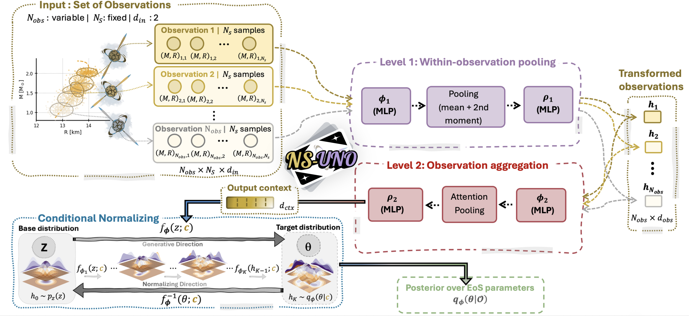

# NS-UNO

### Neutron Star EoS Inference from an Unconstrained Number of Observations

<p align="center">
  
</p>

<p align="center">
  <i>Every neutron star plays its part.</i>
</p>

---

## Overview

**NS-UNO** is a simulation-based inference framework for reconstructing the neutron star equation of state (EoS) from an **unconstrained number of observations**.

The framework combines a **hierarchical DeepSets architecture** with a **conditional normalizing flow**, allowing a single trained model to perform Neural Posterior Estimation (NPE) using observation sets of different sizes. Each neutron star observation is represented by a set of posterior samples, allowing the model to retain information about the observational uncertainties.

NS-UNO is designed for the increasingly diverse multimessenger observations expected from current and next-generation neutron star observations.

This repository contains the code used for the results presented in the associated paper.

---

## Paper

The method and results are described in:

> **V. Carvalho, M. Ferreira, M. Bejger, and C. Providência**,
> *NS-UNO: Neutron Star EoS Inference from an Unconstrained Number of Observations*,
> arXiv:2608.30573 (2026).

📄 **Paper:** [arXiv:2608.30573](https://arxiv.org/abs/2608.30573)
📥 **PDF:** [Download the paper](https://arxiv.org/pdf/2608.30573)

### Abstract

Future multimessenger observations of neutron stars are expected to substantially increase both the number and precision of astrophysical constraints on the equation of state of dense matter. This motivates inference frameworks capable of accommodating a variable, non-fixed number of observations while preserving the posterior information associated with each measurement.

NS-UNO combines a hierarchical DeepSets model with a conditional normalising flow, enabling a single trained model to perform inference from mass-radius observation sets of varying size. The framework is trained jointly on piecewise-polytropic and non-parametric Gaussian-process EoS ensembles and is designed to accommodate observations with different numbers and precisions.

---

## Method

The NS-UNO framework consists of two main components:

1. **Hierarchical DeepSets**
   Processes a variable number of neutron star observations while preserving permutation invariance.

2. **Conditional Normalizing Flow**
   Maps the encoded observational information to the posterior distribution of the neutron star EoS.

This allows the same trained model to be applied to different numbers of observed neutron stars without retraining the model for each observation count.

---

## EoS Models

The framework is trained using multiple classes of neutron star EoS models, including:

* **Piecewise-polytropic (PT) EoSs**
* **Non-parametric Gaussian-process (GP) EoSs**

Training on both parameterized and non-parametric EoS families allows the model to learn a broader representation of the possible neutron star EoS space.

---

## Observations

NS-UNO is designed to work with sets of neutron star observations, including:

* Mass measurements
* Radius measurements
* Mass-radius posterior samples
* Different numbers of observed neutron stars
* Observations with different levels of uncertainty

The number of observations is not fixed during inference, allowing the framework to incorporate additional neutron stars without requiring a separate model for each observation count.

---

## Repository Structure

```text
NS-UNO/
│
├── data_gp_pt.py       # Dataset preparation and generation
├── model.py            # Hierarchical encoder and conditional normalizing flow
├── main_p.py           # Model training and evaluation
├── plots_.py           # Plotting and visualization utilities
├── scheme_UNO_NS.png   # NS-UNO framework schematic
├── requirements.txt    # Python dependencies
└── README.md
```

Large datasets, generated results, plots, model checkpoints, and other generated files are excluded from version control through `.gitignore`.

---

## Installation

Clone the repository and create a Python environment:

```bash
git clone <YOUR-GITHUB-REPOSITORY-URL>
cd NS-UNO
```

Install the required Python packages with:

```bash
pip install -r requirements.txt
```

The code is developed using Python and PyTorch. The complete list of Python dependencies is provided in `requirements.txt`.

> **Note:** PyTorch installation may depend on whether the code is run on a CPU or a CUDA-enabled system. The `requirements.txt` file records the environment used for the experiments reported in the paper.

---

## Data

The large EoS datasets and generated observational datasets are not included in this repository.

The code in `data_gp_pt.py` contains the data preparation and mock-observation generation procedures used in the analysis.

Please refer to the paper for the details of the EoS ensembles, observational data, preprocessing, and noise models.

---

## Usage

The main workflow consists of:

1. Preparing the EoS datasets and mock observations.
2. Initializing the hierarchical DeepSets encoder and conditional normalizing flow.
3. Training the model using `main_p.py`.
4. Evaluating the reconstructed EoS and posterior samples.
5. Generating the corresponding plots.

The training configuration and data paths should be adapted to the local environment before running the code.

---

## Citation

If you use NS-UNO in your research, please cite:

```bibtex
@article{Carvalho2026NSUNO,
  title         = {NS-UNO: Neutron Star EoS Inference from an Unconstrained Number of Observations},
  author        = {Carvalho, Val{\'e}ria and Ferreira, M{\'a}rcio and
                   Bejger, Micha{\l} and Provid{\^e}ncia, Constan{\c{c}}a},
  journal       = {arXiv preprint arXiv:2608.30573},
  year          = {2026},
  eprint        = {2608.30573},
  archivePrefix = {arXiv},
  primaryClass  = {nucl-th}
}
```

---

## License

This repository is released under the terms of the license specified in `LICENSE`.
